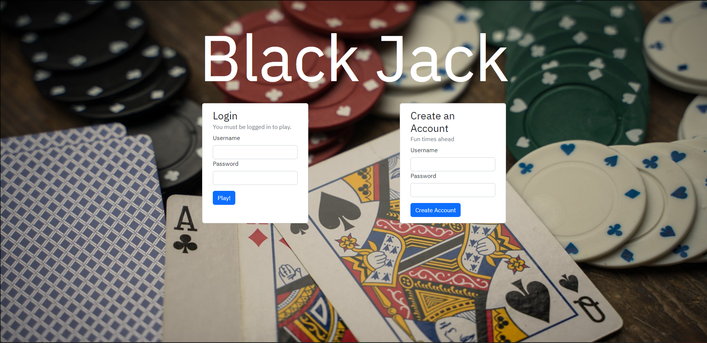
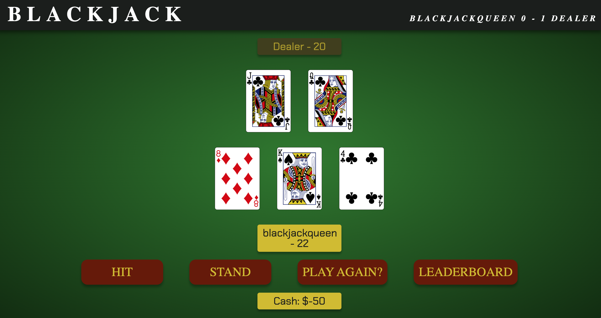
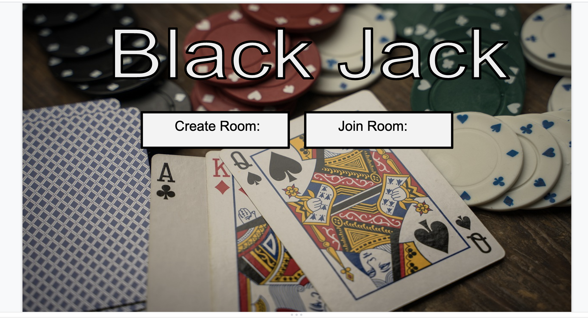
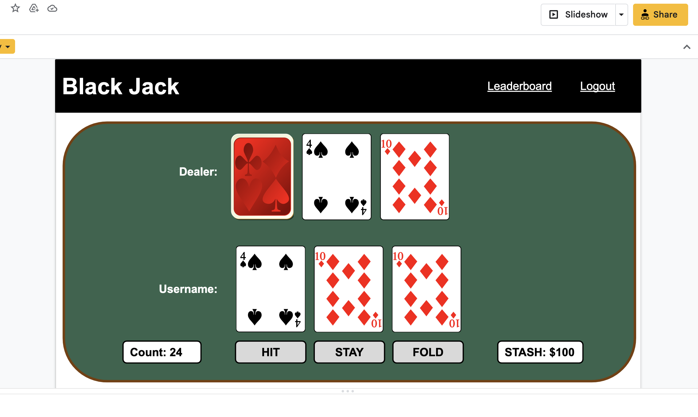
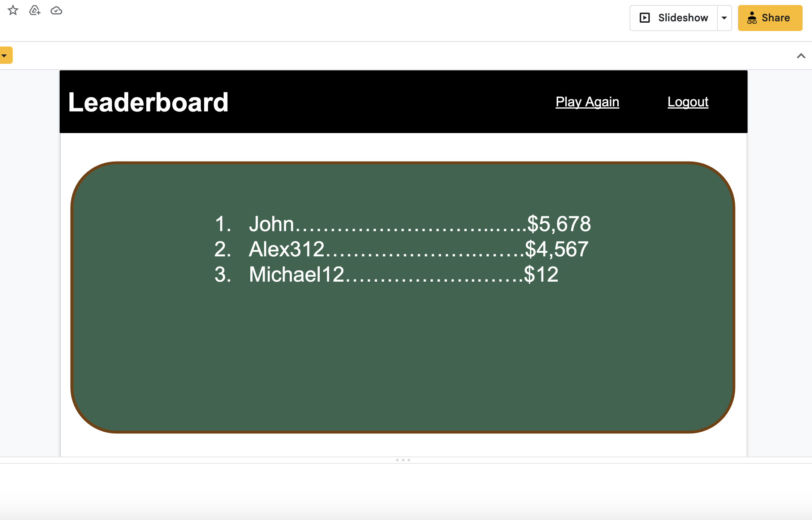

# Blackjack

### 

Blackjack is a classic game dating back hundreds of years, and with a lot of time, we have recreated it with multiple player support! [Play the official game here!](https://blackjackbaby.herokuapp.com/)

## Table of Contents:

- [Getting Started](#getting-started)
- [Browser Support](#browser-support)
- [Deployment](#deployment)
- [Built With](#built-with)
- [Authors](#authors)
- [Acknowledgments](#acknowledgments)

### Homepage

  

### Gameplay

  
  
### Leaderboards

  

## Getting Started

https://github.com/Austinjm121/Blackjack-Baby.git

These instructions will get you a copy of the project up and running on your local machine for development and testing purposes. See deployment for notes on how to deploy the project on a live system.

1. Within GitHub, navigate to the main page of the repository.

2. Click the Clone or download button.

3. Copy the clone URL for the repository.

4. Open Terminal or CMD Prompt(Windows).

5. Change your current working directory to the location where you'd like the cloned directory be stored.

6. Type git clone, and then paste the URL you copied in Step 3.

7. git clone https://github.com/Austinjm121/Blackjack-Baby.git

8. Press Enter and a new local cloned repository will be created. 

### Browser support

| Chrome | 
| --- | 
| 24+ | 

## Deployment

In addition to being deployed on heroku for a limited time, you can locally host this application through one of your local device's PORTs!

1. Run npm start in the command line/terminal. Once the server is running, 

2. Navigate to localhost:{'selected PORT'} in your desired browser

## Built With

* [Node](https://nodejs.org/en/) 
* [npm-express](https://www.npmjs.com/package/express)  
* [MySQLWorkbench](https://www.mysql.com/products/workbench/)  
* [blackjack](https://npm.io/package/blackjack-n-deck)  

## Authors

* **Austin Murray** - [GitHub](https://github.com/Austinjm121)
* **Aileen Bryand** - [GitHub](https://github.com/aileenbryand)
* **Chelsea Sexton** - [GitHub](https://github.com/chelsea314)
* **Martin Mendoza** - [GitHub](https://github.com/mmdoza002)
* **Mitchell Merka** - [GitHub](https://github.com/levmerka)

## Development

As with any game, we started with just our ideas. Our Flowcharts and initial visions are below:

### Multiplayer:

  

### The in-game UI:

  

### Leaderboard UIL

  

## License

## Acknowledgments

Codepen
